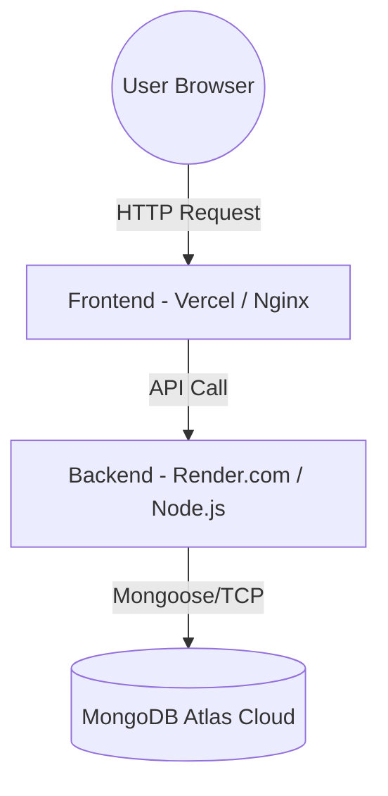

# BÁO CÁO BÀI TẬP: CONTAINERIZATION, CI/CD VÀ DEPLOYMENT

## 2.5. Container với Docker/Kubernetes (1 điểm)

**Tên Tool sử dụng:** Docker, Docker Compose, Docker Hub  
**Link dự án Repository:** *[Sinh viên điền link GitHub/GitLab của dự án vào đây]*

### Chi tiết Dockerfile

#### 1. Backend (`backend/Dockerfile`)
```dockerfile
FROM node:18-alpine
WORKDIR /usr/src/app
COPY package*.json ./
RUN npm install --production
COPY . .
EXPOSE 5000
CMD ["npm", "start"]
```
**Giải thích công thức:**
- `FROM node:18-alpine`: Sử dụng image Node.js phiên bản 18 trên nền Alpine Linux (rất nhẹ, giúp giảm dung lượng image).
- `WORKDIR /usr/src/app`: Thiết lập thư mục làm việc mặc định bên trong container.
- `COPY package*.json ./`: Chỉ copy các file quản lý thư viện vào trước để tận dụng Docker Cache (nếu file package không đổi thì không cần tải lại thư viện ở lần build sau).
- `RUN npm install --production`: Cài đặt các thư viện cần thiết để chạy ứng dụng (bỏ qua devDependencies để tối ưu dung lượng).
- `COPY . .`: Copy toàn bộ source code backend vào container.
- `EXPOSE 5000`: Mở port 5000 cho container để có thể giao tiếp từ bên ngoài.
- `CMD ["npm", "start"]`: Lệnh khởi chạy server Node.js khi container bắt đầu chạy.

#### 2. Frontend (`frontend/Dockerfile`)
```dockerfile
FROM nginx:alpine
COPY . /usr/share/nginx/html
EXPOSE 80
CMD ["nginx", "-g", "daemon off;"]
```
**Giải thích công thức:**
- `FROM nginx:alpine`: Sử dụng web server Nginx bản Alpine gọn nhẹ để phục vụ các file tĩnh (HTML, CSS, JS) của frontend.
- `COPY . /usr/share/nginx/html`: Đưa toàn bộ code frontend chứa giao diện vào thư mục mặc định mà Nginx sẽ dùng để host web.
- `EXPOSE 80`: Mở port 80 cho web traffic (HTTP).
- `CMD ["nginx", "-g", "daemon off;"]`: Chạy Nginx ở chế độ foreground giúp container không bị tắt ngay sau khi chạy.

### Chi tiết docker-compose.yml
**Cấu hình hệ thống:** Tệp `docker-compose.yml` kết nối 3 services thiết yếu:
- **`database`**: Sử dụng MongoDB version 6. Ánh xạ cổng `27017:27017` và dùng volume `mongo_data` để dữ liệu không bị mất khi xóa container.
- **`backend`**: Build từ thư mục `./backend`. Map cổng `5000:5000`. Thiết lập biến môi trường kết nối sang MongoDB (`mongodb://database:27017/shopping-pet`). Định nghĩa `depends_on: database` để đảm bảo khởi chạy db trước.
- **`frontend`**: Build từ thư mục `./frontend` và phục vụ trên cổng `80:80`. Ràng buộc `depends_on: backend`.

**Đưa lên Registry Public sử dụng kỹ thuật Tags:**
Để đưa image lên Docker Hub, thực hiện các lệnh sau:
```bash
# Build & tag images
docker build -t <username>/shopping_pet_backend:v1.0 ./backend
docker build -t <username>/shopping_pet_frontend:v1.0 ./frontend

# Push lên Docker Hub
docker push <username>/shopping_pet_backend:v1.0
docker push <username>/shopping_pet_frontend:v1.0
```

> **YÊU CẦU CHẤM ĐIỂM (SINH VIÊN TỰ LÀM):**
> 1. Chụp màn hình thư mục `Images` trong giao diện phần mềm Docker Desktop.
> 2. Chụp màn hình thư mục `Containers` đang chạy (màu xanh lá) trong Docker Desktop.
> 3. Chụp màn hình tài khoản Docker Hub của bạn đang chứa các image đã push với tag (ví dụ: `v1.0`, `latest`).
> *[CHÈN 3 ẢNH CHỤP MÀN HÌNH VÀO ĐÂY]*

---

## 2.6. CI/CD (0,5 điểm)

**Tên Tool sử dụng:** GitHub Actions

### Chi tiết Pipeline/Workflow
Được cấu hình trong file: `.github/workflows/ci-cd.yml` gồm các Stage:
1. **Build & Test (`build-and-test` job):**
   - Checkout code từ branch `main`.
   - Setup môi trường Node.js 18.
   - Chạy lệnh `npm install` để build dependency và kiểm tra code có bị lỗi syntax hay không. (Nếu có UnitTest thì chạy `npm test`).
2. **Deploy (`docker-build-push` job):**
   - Đăng nhập vào Docker Hub tự động thông qua `secrets.DOCKERHUB_USERNAME` và `TOKEN`.
   - Build Docker Image mới dựa trên Commit SHA hiện tại giúp dễ dàng quản lý phiên bản.
   - Push thẳng lên public registry (Docker Hub) với 2 tag liên tục là `latest` và `<github_commit_sha>`.

### Chi tiết file cấu hình YAML (Các viện/action sử dụng)
- `actions/checkout@v3`: Action tiêu chuẩn của Github để kéo source code về máy chủ chạy CI/CD.
- `actions/setup-node@v3`: Action thiết lập môi trường Node.js.
- `docker/setup-buildx-action@v2`: Công cụ hỗ trợ build Docker image nâng cao.
- `docker/login-action@v2`: Tự động xác thực tài khoản Docker Hub do Docker cung cấp.
- `docker/build-push-action@v4`: Thư viện xử lý việc nhận diện Dockerfile, build và push image kèm tags cực kỳ tối ưu và an toàn.

> **YÊU CẦU CHẤM ĐIỂM (SINH VIÊN TỰ LÀM):**
> Đẩy code chứa file `.github/workflows/ci-cd.yml` lên GitHub, để Actions chạy, sau đó chụp màn hình:
> 1. Màn hình chi tiết một pipeline thành công (màu xanh lá / Success).
> 2. Màn hình một pipeline gặp lỗi (màu đỏ / Failed) do push sai code (tùy chọn làm kịch bản sai).
> 3. Màn hình lịch sử CI/CD (Danh sách các workflow run hiển thị thời gian, commit message).
> *[CHÈN 3 ẢNH CHỤP MÀN HÌNH VÀO ĐÂY]*

---

## 2.7. Triển khai hệ thống và các Tool mở rộng (1 điểm)

**Tên Nền tảng sử dụng và Link dự án:**
- **Frontend & Backend Deploy:** Nền tảng Render (Render.com) hoặc Vercel (cho Frontend).
- **Database:** MongoDB Atlas (Cloud Database miễn phí).
- **Link Website Demo:** *[Sinh viên điền link website sau khi đã deploy thành công]*

### Kiến trúc Deploy


**Giải thích chi tiết kiến trúc:**
- Người dùng khi truy cập sẽ gọi xuống Vercel (nơi đang host Frontend). Vercel cung cấp CDN toàn cầu giúp tải file tĩnh (HTML/JS) siêu nhanh.
- Frontend sẽ gọi RESTful APIs đến máy chủ ảo (Web Service) được host trên Render (chạy Node.js & Express). Render sẽ tự động pull image/code mới nhất từ GitHub bất cứ lúc nào pipeline chạy xong.
- Nút thắt dữ liệu sẽ nằm ở MongoDB Atlas, một managed database hoạt động 24/7 và scale tốt. Backend Node.js kết nối đến Atlas qua Mongoose (kèm chuỗi connection str an toàn). 

### Các công nghệ sử dụng khi deploy
- **Vercel / Render:** Nền tảng PaaS (Platform as a Service) loại bỏ thao tác quản lý máy chủ thủ công (Serverless). Tích hợp cực sâu với GitHub.
- **MongoDB Atlas:** DBaaS (Database as a Service) đáp ứng tính sẵn sàng cao, bảo mật bằng Network Peering / IP Whitelist.
- **Docker:** Đóng gói tất cả giúp code chạy được trên bất cứ cloud nào hỗ trợ Docker Runtime.

### Tool mở rộng: Automation & Security Tool
- **Tool Áp Dụng:** SonarCloud (Tích hợp trong GitHub CI/CD).
- **Phân tích:**
  - SonarCloud là một công cụ *Static Application Security Testing (SAST)* và đo lường *Code Quality*.
  - **Ảnh hưởng đến chất lượng dự án:** Tại bước "Build & Test" trong pipeline CI/CD, SonarCloud sẽ tự động scan mã nguồn từ Backend/Frontend. Nó có khả năng phát hiện các lỗ hổng (vulnerabilities), code bốc mùi (code smells) và bugs tìm ẩn. Báo cáo này giúp dev sửa lỗi trước khi code được merge vào nhánh chính.
  - **Tối ưu:** Giúp nhóm tiết kiệm thời gian review code thủ công, tự động từ chối các Pull Request có độ phủ Test Coverage thấp, đảm bảo phần mềm hoàn thiện được bảo mật cao tránh bị tấn công Injection hoặc XSS.
